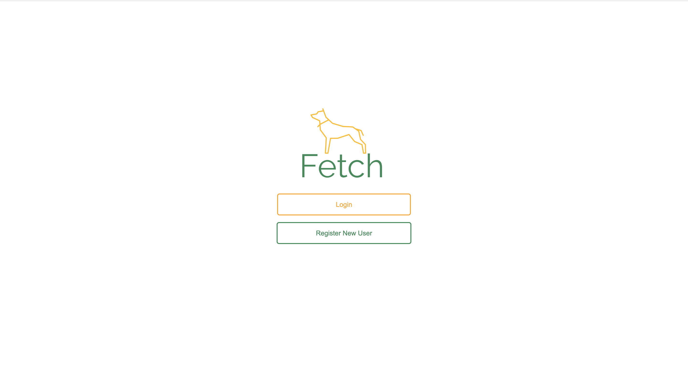
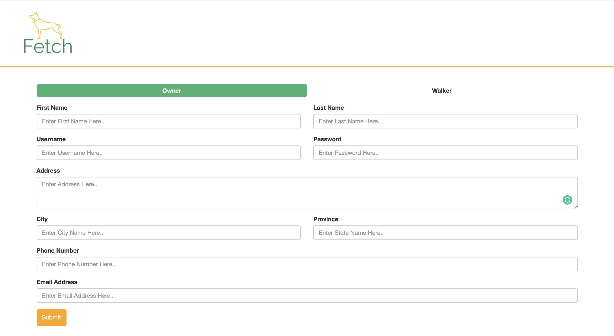
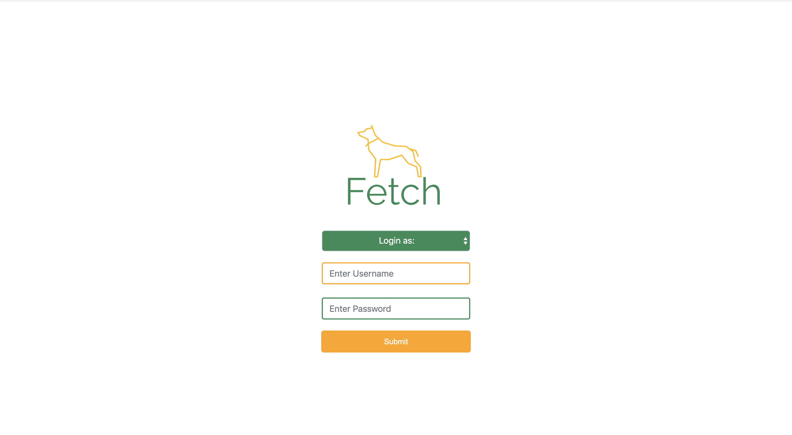
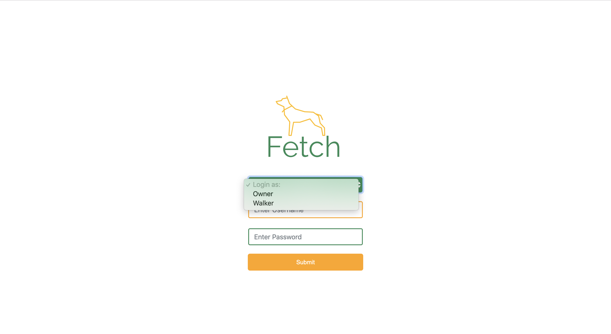
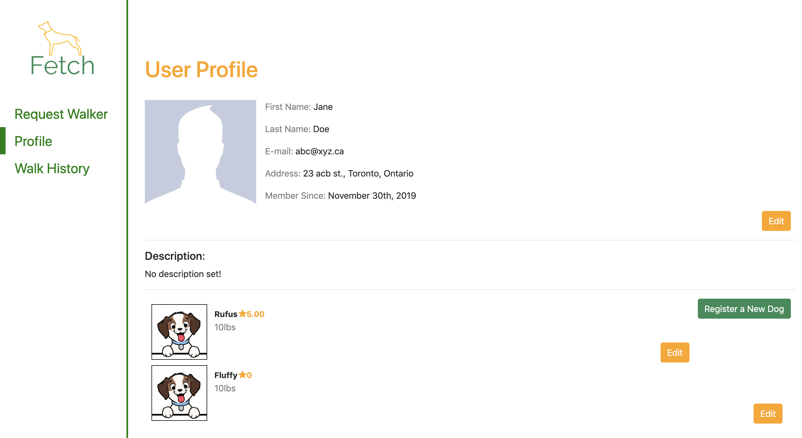
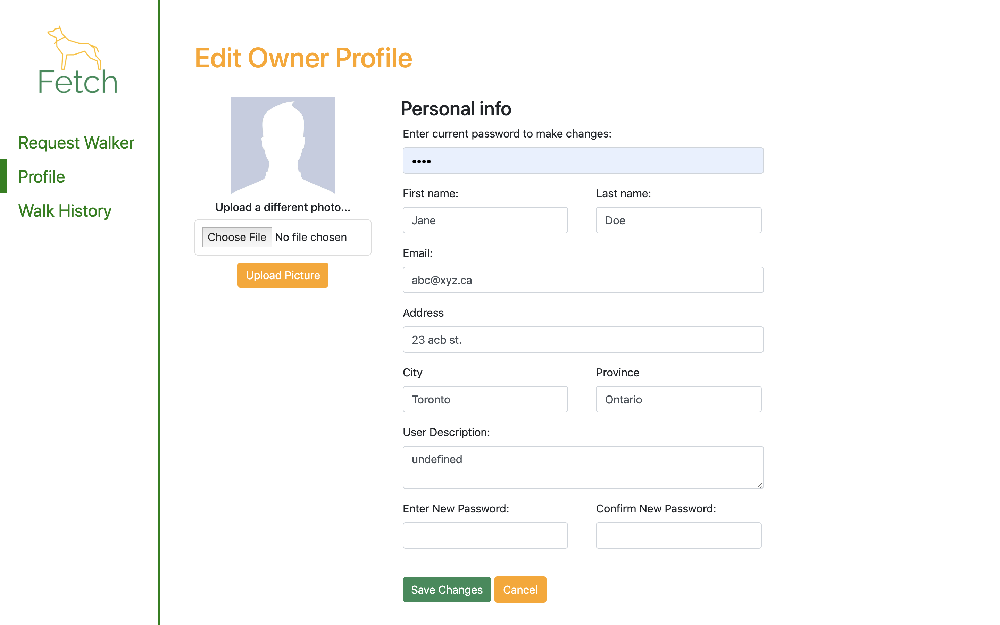
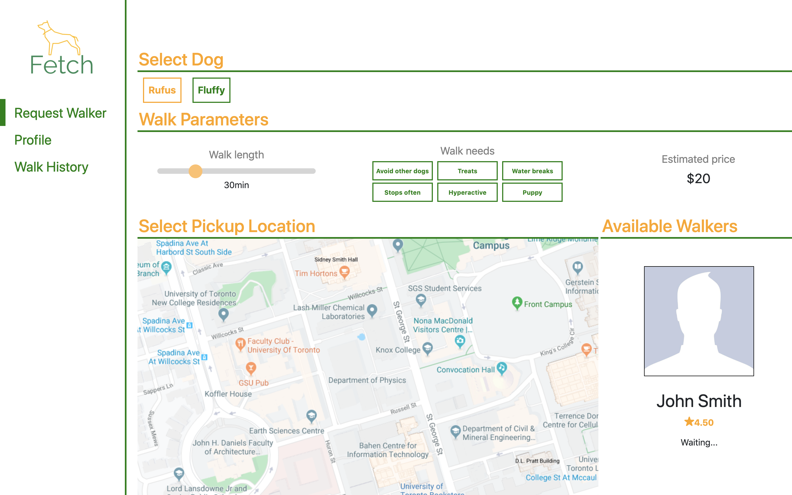
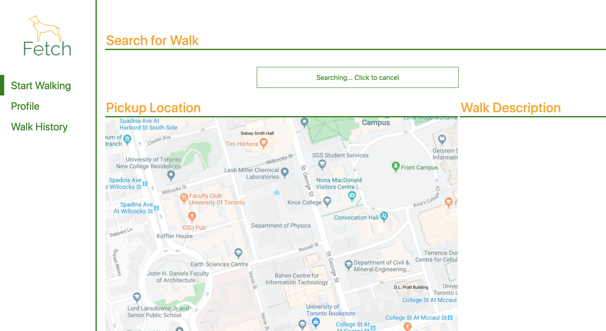
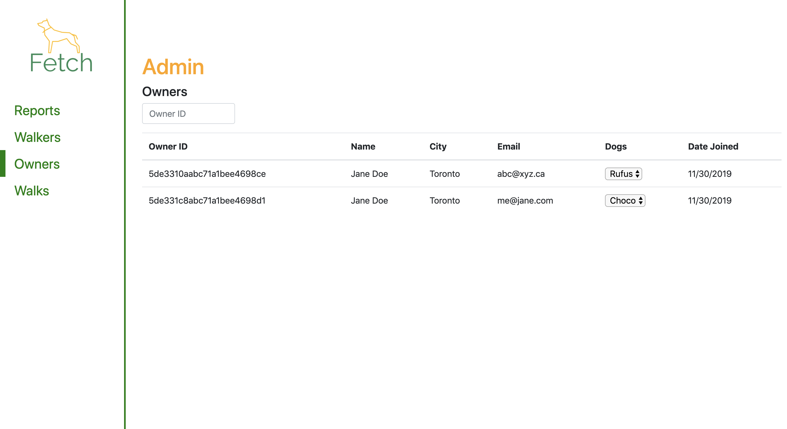
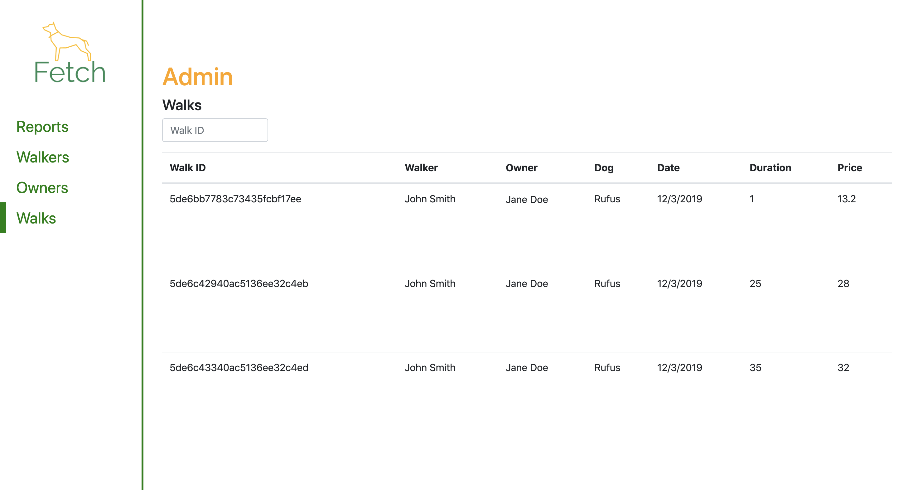

# Fetch (team02)

A dog walking application. 

 

## Login 

Upon running the application, the login view will show

 

Registering a new user takes you to the signup page with the option to select the type of user you are registering (Owner or Walker) and the regular signup forms. 

 

---

To login as a user, from the <code>index.html</code> select the corresponding user you want to login as. 

---

<strong>To login as an Admin: </strong>

Username: admin

Password: admin

---

Otherwise have to signup as a walker or owner to login. 

 

## User functionality

The user can do three things: view and edit their profile, request a walk, and view walk history.

 

### Owner User

Once you sign in as a Owner user, you will be redirected to the user profile. 

 

The user can edit their profile, view their dog's profile, delete their account, signout. 

 

------- did up to here

<strong>Request Walker </strong>

On this page, the user selects the dog that they would like walked and the parameters of the walk, such as length and needs. 

 

The estimated price updates automatically based on selected parameters. Once the user has selected their parameters, they select the dog's location on the map, and available walkers are shown. Selecting a walker shows a confirmation screen and the ability to enter pickup instructions for the dog, such as how to get to the dog.

 

Clicking confirm brings the user to the walk status page.

 

On the walk status page, the user gets updates from the walker on their location. We plan on using the Google Maps API for automated location updates in Phase 2, so this page approximates that functionality. The user can view the estimated time until the walk is complete, notes from the walker, and the estimated price. Once the walk is completed, the user is asked to rate their walker and report anything they were unsatisfied about. The user is also given the option to submit a complaint that is sent to an admin.

 

There is also a walk history page that displays all the walks the user has completed. 

 
 

### Walker User

Once you sign in as a Dog user, this takes the user to the User Profile page (same view as the dog user profile, without the dog)

 

<strong>Accept Walk </strong>

On this page, the walker clicks "Find Walk" to start looking for walks. 

Once a dog walking request is available, the view will show a walk description of the dog requesting for a walk. This includes the price of the walk, duration, and walking needs. 

 

Once the walker accepts the walk, the view shows the walk in progress, with the ability of the walker to add notes while walking to update to the dog owner. As mentioned above, we plan on using the Google Maps API for automated location updates in Phase 2.

 

Once the walk is finished, the right box allows for rating and comment input. 

 
 

## Admin Functionality

The admin has access to all reports, all dog users, and all admins. 

 
 
 
 
